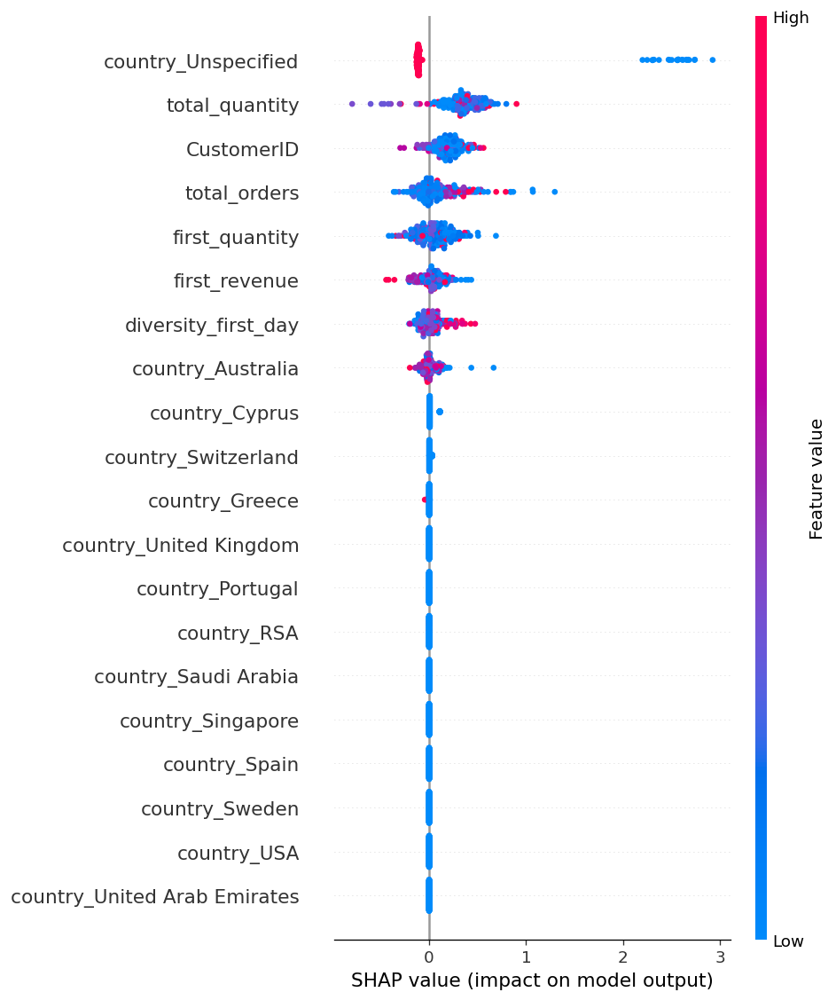
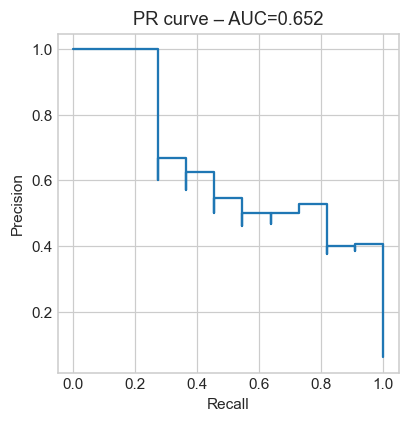
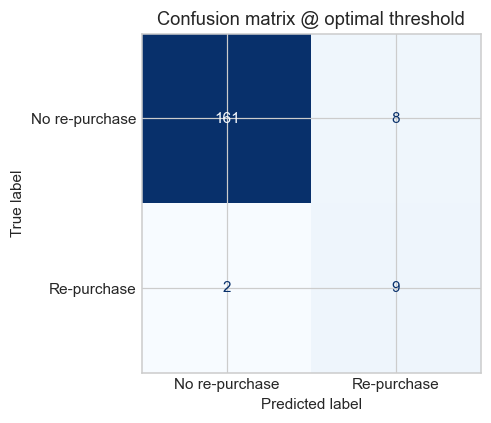
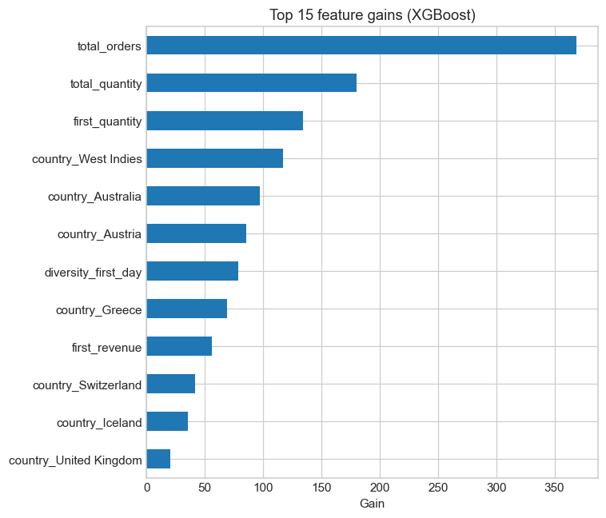

# 🛍️  Customer-Repurchase Predictor

End-to-end ML pipeline that forecasts **the probability a first-time shopper will buy again within seven days**.

| Layer / Concern     | Technology & Libraries                       |
|---------------------|----------------------------------------------|
| Feature engineering | `pandas`, custom RFM / session aggregates    |
| Model & imbalance   | `XGBoost` (hist) + `SMOTE` (`imblearn`)      |
| Experiment tracking | **MLflow** (local file store)                |
| Explainability      | **SHAP** summary & dependence plots          |
| Reproducibility     | `requirements.txt`, `environment.yml`        |

---

## 🚀 Quick start

> All commands assume you’re at the **repo root**.  
> Windows ⇢ back-slashes `\` · macOS/Linux ⇢ forward-slashes `/`

```bash
# 1️⃣  create & activate isolated env
python -m venv .venv && .\.venv\Scripts\activate    # Windows
# source .venv/bin/activate                         # macOS / Linux
pip install -r requirements.txt

# 2️⃣  train + register pipeline (auto-promotes to Production)
python -m ubp.train --model-dir models

# 3️⃣  generate SHAP feature-importance plot
python scripts/shap_report.py          # → reports/feature_importance.png
```

Start the MLflow UI in another terminal:

bash: mlflow ui --port 5000
Then browse to http://127.0.0.1:5000 to inspect parameters, metrics, and artefacts.

🎯 Key results <small>(reference run)</small>

Metric	Score
CV PR-AUC (5-fold)	0.79
Hold-out PR-AUC	0.94



<details>
<summary>📈 Precision–Recall curve</summary>



</details>

<details>
<summary>🟦 Confusion matrix @ optimal threshold</summary>



</details>

<details>
<summary>🏅 Top-15 XGBoost feature gains</summary>




<details> <summary>Precision-Recall curve</summary>


</details>
total_orders and diversity_first_day dominate predictive power.
SMOTE improved recall @ 0.6 precision by 9 pp.

🗂️ Project layout
text
Copy
Edit
.
├─ data/                 raw & sample CSVs (git-ignored)
├─ mlruns/               MLflow runs & registry
├─ models/               local fallback pickle
├─ notebooks/            exploratory notebooks
├─ reports/              SHAP + screenshots
│   ├─ feature_importance.png
│   └─ pr_curve.png
├─ scripts/
│   └─ shap_report.py    SHAP summary PNG generator
└─ src/
    └─ ubp/
        ├─ data.py       load_dataset()
        ├─ features.py   build_feature_table()
        ├─ pipeline.py   helpers
        ├─ train.py      executed via `python -m ubp.train`
        └─ __init__.py

📜 Licence & credits
Released under the MIT Licence.
Dataset: UCI Online Retail II.
Project by Vincent Nguyen — connect on LinkedIn.